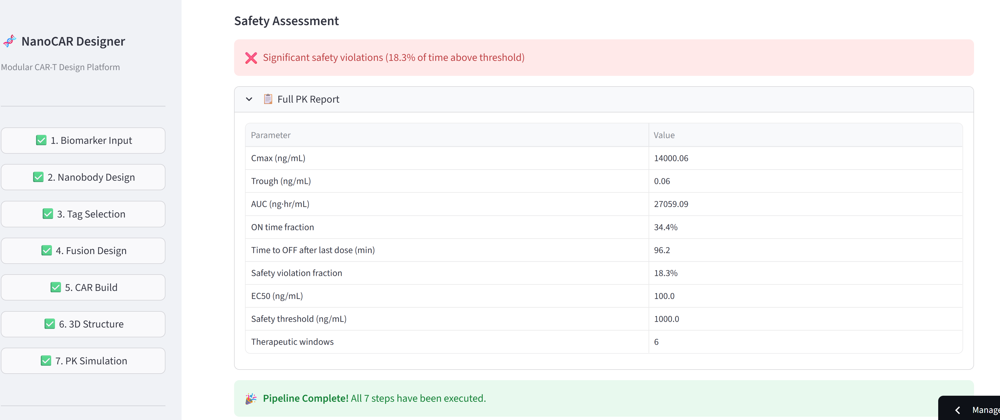

# 🧬 NanoCAR Designer

[](https://nanocar-designer-d6wlsnzpwrx97iyvartqrm.streamlit.app/)


**Modular CAR-T Cell Therapy Design Platform** — A computational design tool for nanobody × tag recognition modular CAR-T constructs, supporting 5 major platforms: UniCAR, sCAR, SUPRA CAR, Anti-FITC CAR, and ALFA-CAR.

> **Live Demo:** [nanocar-designer.streamlit.app](https://nanocar-designer-d6wlsnzpwrx97iyvartqrm.streamlit.app/)

---




## Motivation

Modular CAR-T systems decouple tumor recognition from T cell activation using an adapter molecule (tagged nanobody), enabling tunable ON/OFF control, multi-target switching, and improved safety profiles. This tool streamlines the computational design workflow — from target identification to PK simulation — providing experimentalists with optimized constructs ready for wet-lab validation.

## 7-Step Design Pipeline

```
Biomarker → Nanobody → Tag → Fusion → CAR → Structure → PK/Safety
   Input     Design    Select  Design   Build  Predict    Simulate
```

| Step | Module | Description | Key Features |
|:----:|--------|-------------|-------------|
| 1 | Biomarker Input | Target protein identification | UniProt REST API, manual input, extracellular domain extraction |
| 2 | Nanobody Design | VHH sequence generation | RCSB PDB search + humanized framework CDR grafting (dual approach) |
| 3 | Tag Selection | Adapter tag system comparison | 5-axis radar chart, priority-based recommendation |
| 4 | Fusion Design | Nb-linker-Tag assembly | 9 linker options, orientation control, physicochemical properties (MW/pI/GRAVY), codon optimization |
| 5 | CAR Build | Chimeric antigen receptor assembly | Modular domain selection (hinge/TM/costim/signaling), domain architecture map |
| 6 | 3D Structure | Structure prediction & visualization | ESMFold API, py3Dmol interactive 3D viewer, domain color-coding |
| 7 | PK Simulation | Pharmacokinetics & safety | One-compartment model, Hill equation ON/OFF dynamics, therapeutic window |

## Tag Systems Supported

| Tag | Platform | Origin | Clinical Stage | Recognition |
|-----|----------|--------|:--------------:|-------------|
| **5B9** | UniCAR | La/SS-B epitope (10 aa) | Phase I | Anti-5B9 scFv |
| **PNE** | sCAR | GCN4-derived neo-epitope (14 aa) | Preclinical | Anti-GCN4 scFv |
| **FITC** | Anti-FITC CAR | Fluorescein (small molecule) | Phase I | Anti-FITC scFv |
| **ALFA** | ALFA-CAR | Engineered α-helical peptide (13 aa) | Preclinical | NbALFA (nanobody) |
| **Leucine Zipper** | SUPRA CAR | Coiled-coil pair (MIT) | Preclinical | Cognate zipper |

## Quick Start

```bash
# Clone
git clone https://github.com/TSUBAKI0531/NanoCAR-Designer.git
cd NanoCAR-Designer

# Install & run
pip install -r requirements.txt
streamlit run app.py
```

## Architecture

```
NanoCAR-Designer/
├── app.py                  # Streamlit UI — 7-step pipeline (971 lines)
├── biomarker.py            # UniProt API integration
├── nanobody.py             # VHH search & CDR grafting
├── tag_system.py           # Tag comparison & recommendation
├── fusion_designer.py      # Fusion protein design & properties
├── car_builder.py          # Modular CAR domain assembly
├── structure_viewer.py     # ESMFold + py3Dmol visualization
├── pk_simulator.py         # PK/safety simulation
├── requirements.txt
├── README.md
└── data/
    ├── tag_database.json       # 5 tag systems with scored properties
    ├── car_domains.json        # CAR domain reference sequences
    ├── vhh_frameworks.json     # 3 humanized VHH framework templates
    └── linker_library.json     # 9 linker sequences (flexible/rigid/extended)
```

**Total: ~3,100 lines** across 8 Python modules + 4 JSON data files.

## Technical Highlights

- **Dual nanobody sourcing** — Database search (RCSB PDB REST API) and template-based CDR grafting with IMGT-approximate annotation
- **Curated domain library** — 5 recognition domains, 3 hinges, 2 TM domains, 3 costimulatory domains, all with UniProt-sourced reference sequences
- **Physicochemical engine** — MW, pI (bisection method), instability index, GRAVY (Kyte-Doolittle), codon optimization (human/E.coli)
- **PK modeling** — One-compartment IV bolus with repeated dosing, Hill equation activation dynamics, AUC (trapezoidal), therapeutic window analysis
- **3D visualization** — ESMFold API prediction → py3Dmol rendering with setTimeout CDN fix, domain-specific color coding

## Dependencies

| Package | Purpose |
|---------|---------|
| streamlit | Web UI framework |
| requests | API calls (UniProt, RCSB, ESMFold) |
| biopython | Sequence handling |
| plotly | Interactive charts (radar, PK curves) |
| numpy | Numerical computation |
| pandas | Data table display |

## Data Sources & References

- **UniProt REST API** — Protein sequence and annotation retrieval
- **RCSB PDB Search API** — VHH/nanobody structure search
- **ESMFold API** — Structure prediction for designed sequences
- **Literature basis** — Comprehensive review of nanobody × tag recognition modular CAR-T cell therapy (2016–2025), covering UniCAR (Albert et al.), sCAR (Rodgers et al.), SUPRA CAR (Cho et al.), Anti-FITC CAR (Kim et al.), and ALFA-CAR (Götzke et al.) systems

## Author

**TSUBAKI0531** — Immunology researcher with wet-lab antibody engineering expertise, developing computational tools for bio × AI research applications.

## License

MIT License
